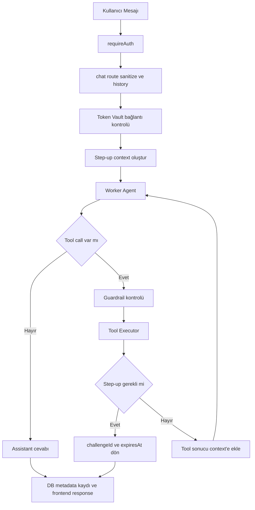
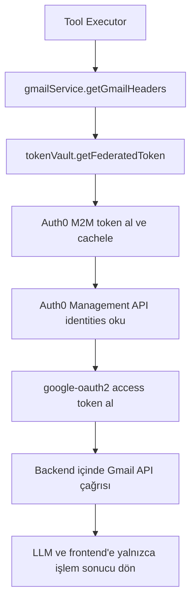
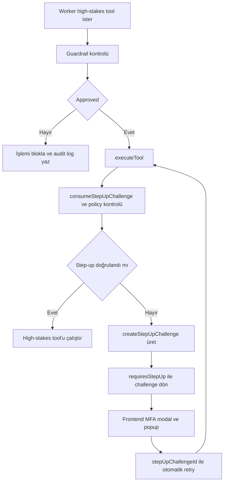
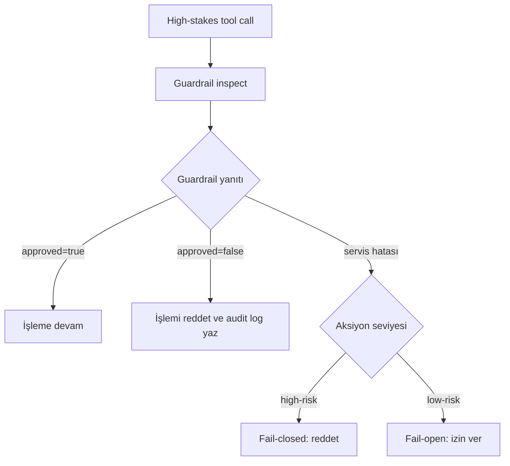
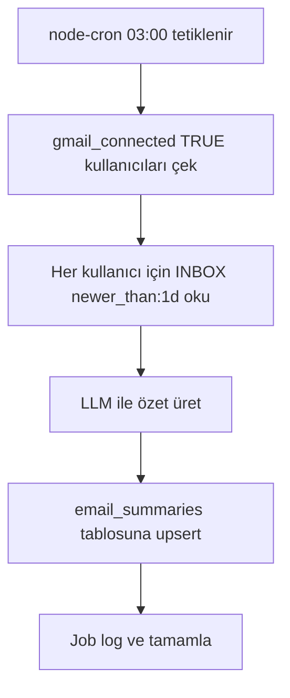

# Knowhy - AI Email Assistant

> Auth0 "Authorized to Act" Hackathon Project

**[TR]** Yapay zeka destekli, güvenli e-posta asistanı. Auth0 Token Vault ile Zero Trust mimarisi üzerine inşa edilmiştir.

**[EN]** AI-powered secure email assistant built on Auth0 Token Vault with Zero Trust architecture.

---

## Özellikler / Features

**[TR]**
- **Auth0 Login & Token Vault** - Güvenli kimlik doğrulama, Google token'ları Auth0 Token Vault'ta saklanır
- **Blind Token Injection** - LLM hiçbir zaman token görmez
- **Agent-to-Agent (Guardrail)** - Worker + Guardrail çift ajan güvenlik mimarisi
- **Step-up Authentication** - E-posta gönderme/silme için MFA onayı
- **Asenkron Otomasyon** - Gece otomatik e-posta özetleme
- **Çoklu Dil** - Türkçe / İngilizce (i18n)
- **Dockerize** - Tek komutla ayağa kalkma

**[EN]**
- **Auth0 Login & Token Vault** - Secure authentication with Google tokens stored in Auth0 Token Vault
- **Blind Token Injection** - LLM never sees any tokens
- **Agent-to-Agent (Guardrail)** - Worker + Guardrail dual-agent security architecture
- **Step-up Authentication** - MFA approval required for sending/deleting emails
- **Asynchronous Automation** - Nightly automatic email summarization
- **Multi-Language** - Turkish / English (i18n)
- **Dockerized** - Single command startup

## Tech Stack

| Layer / Katman | Technology / Teknoloji |
|----------------|------------------------|
| Frontend | React, Vite, TailwindCSS |
| Backend | Node.js, Express |
| Database | PostgreSQL |
| AI | OpenRouter API |
| Auth | Auth0 (Token Vault, CIBA, MFA) |
| DevOps | Docker, Google Cloud Run |

## Quick Start / Hızlı Başlangıç

```bash
# 1. Install dependencies / Bağımlılıkları yükle
npm run install:all

# 2. Create .env file / .env dosyasını oluştur
cp .env.example .env
# Edit .env and fill in values / .env dosyasını düzenle ve değerleri doldur

# 3. Start with Docker (includes PostgreSQL) / Docker ile başlat (PostgreSQL dahil)
docker-compose up --build

# OR / VEYA local development / local geliştirme
npm run dev
```

## Deployment

**[TR]** Render üzerine yayınlamak için hazır blueprint dosyası: `render.yaml` (backend + static frontend + postgres). Adım adım kurulum: `docs/deploy/render.md`

**[EN]** Ready-to-use blueprint for Render deployment: `render.yaml` (backend + static frontend + postgres). Step-by-step setup: `docs/deploy/render.md`

## Project Structure / Proje Yapısı

```
Knowhy_auht0/
├── .env                    # Environment variables (not in git)
├── .env.example            # Environment template
├── docker-compose.yml      # Docker (Postgres + Backend + Frontend)
├── client/                 # React + Vite + TailwindCSS frontend
│   ├── src/
│   │   ├── components/     # Layout, Sidebar, LoadingScreen
│   │   ├── pages/          # LoginPage, ChatPage, SettingsPage
│   │   ├── services/       # api.js (centralized backend communication)
│   │   ├── i18n/           # Multi-language (TR/EN)
│   │   └── main.jsx
│   ├── vite.config.js      # envDir: reads root .env
│   └── Dockerfile          # Multi-stage (build + nginx)
├── server/                 # Node.js + Express backend
│   ├── src/
│   │   ├── services/
│   │   │   ├── tokenVault.js      # Auth0 Token Vault (M2M)
│   │   │   ├── gmail.js           # Gmail API (Blind Token Injection)
│   │   │   ├── openrouter.js      # OpenRouter LLM calls
│   │   │   ├── workerAgent.js     # Worker Agent (user request → tool call)
│   │   │   ├── guardrailAgent.js  # Security Agent (content inspection)
│   │   │   ├── toolExecutor.js    # Tool call → Gmail API (remote arm)
│   │   │   ├── tools.js           # LLM tool definitions
│   │   │   ├── stepUpAuth.js      # CIBA Step-up Auth (MFA)
│   │   │   └── cronJobs.js        # Nightly email summarization
│   │   ├── routes/         # auth, chat, email, stepup, user, health
│   │   ├── middleware/     # JWT auth, error handler, audit log
│   │   ├── db/             # PostgreSQL init + query helpers
│   │   └── index.js
│   └── Dockerfile
└── docs/
    ├── history/            # Revision notes (001, 002, 003...)
    └── test/               # Test scripts
```

## Architecture / Mimari

```
[User] → [React UI] → [Express API] → [Worker Agent]
                              ↓               ↓
                        [Auth0 Token Vault] [Guardrail Agent]
                              ↓               ↓
                        [Gmail API]      [Approve/Reject]
```

**[TR]** **Blind Token Injection**: LLM sadece `{"action": "read_email"}` gibi JSON tool call gönderir. Backend token'ı Token Vault'tan çeker, Gmail API'ye istek yapar ve LLM'e sadece sonucu döner.

**[EN]** **Blind Token Injection**: The LLM only sends JSON tool calls like `{"action": "read_email"}`. The backend retrieves the token from Token Vault, makes the Gmail API request, and only returns the result to the LLM.

---

## Algorithm Flows for Hackathon Evaluation / Yarışma Değerlendirmesi İçin Algoritma Akışları

**[TR]** Bu bölüm, `Authorized to Act: Auth0 for AI Agents` değerlendirme kriterlerine göre proje akışını teknik olarak özetler.

**[EN]** This section technically summarizes the project flow according to the `Authorized to Act: Auth0 for AI Agents` evaluation criteria.

### Flow 1: Chat to Tool Execution Pipeline / Akış 1: Sohbetten Tool Çalıştırmaya

```text
INPUT: userMessage, accessToken, locale, optional(stepUpChallengeId)

1) requireAuth middleware:
   - JWT signature + issuer + audience validated
   - user + stepUpClaims (amr/acr/auth_time/iat) extracted
   - upsert to users table

2) /api/chat:
   - Message sanitized, written to conversation/messages tables
   - hasGoogleConnection() validates live Token Vault connection
   - buildStepUpContextFromClaims() prepares step-up context

3) workerAgent.processMessage():
   - System prompt set based on locale
   - Model called within MAX_TOOL_ROUNDS (5)
   - Returns final answer if no tool call
   - If tool call:
     a) guardrail inspectToolCall() for high-stakes
     b) executeTool() called
     c) result added to conversation context as tool result
     d) if requiresStepUp, returns challenge info to user

4) Output:
   - Assistant answer written to DB with metadata (toolResults, guardrailFlags, stepUpRequest)
   - Safe response returned to frontend
```



### Flow 2: Blind Token Injection / Akış 2: Blind Token Injection

```text
INPUT: auth0UserId

1) toolExecutor -> gmailService
2) gmailService.getGmailHeaders():
   - tokenVault.getFederatedToken(auth0UserId)
3) tokenVault.getFederatedToken():
   - Gets/caches Auth0 M2M token
   - Reads user identities from Management API
   - Gets google-oauth2 identity access_token
4) Gmail API call made in backend with Authorization: Bearer <token>
5) Only operation result returned to LLM/frontend (token NEVER returned)
```



### Flow 3: High-Stakes + Step-up MFA / Akış 3: Yüksek Risk + Step-up MFA

**[TR]** Yüksek riskli tool'lar: `send_email`, `delete_email`, `delete_latest_email`.

**[EN]** High-risk tools: `send_email`, `delete_email`, `delete_latest_email`.

```text
1) Worker wants to call high-stakes tool
2) Guardrail approval obtained (tool argument security)
3) executeTool():
   - consumeStepUpChallenge() + policy check (recent auth + MFA claim)
   - If no verification, createStepUpChallenge() generates
   - returns requiresStepUp=true with challengeId/expiresAt
4) Frontend:
   - Opens MFA modal
   - Completes step-up with loginWithPopup(acr_values=multi-factor)
   - Auto-retry same user message with stepUpChallengeId
5) Backend:
   - buildStepUpContextFromClaims + consumeStepUpChallenge
   - If challenge fresh, high-stakes tool runs
```



### Flow 4: Guardrail Decision Algorithm / Akış 4: Guardrail Karar Algoritması

```text
1) High-stakes tool call -> Guardrail waits for JSON decision
2) If approved=false, operation blocked + audit log written
3) If Guardrail service error:
   - high-risk action: fail-closed (reject)
   - low-risk action: fail-open (allow for UX)
4) Thus security and usability balance is maintained
```



### Flow 5: Asynchronous Nightly Summarization / Akış 5: Asenkron Gece Özetleme

```text
1) node-cron triggers every day at 03:00 (Europe/Istanbul)
2) Fetches gmail_connected=TRUE users
3) For each user, reads last 24 hours emails from Gmail
4) Generates brief summary with LLM
5) Upserts to email_summaries table
```



### Judging Criteria Mapping / Jüri Kriteri Eşlemesi

| Criterion / Kriter | Project Implementation / Projedeki Karşılığı |
|-------------------|-----------------------------------------------|
| Security Model | Blind Token Injection, Guardrail Agent, Step-up MFA, JWT validation, audit log |
| User Control | Gmail connect/disconnect, scope-based permission control, explicit MFA approval for high-stakes |
| Technical Execution | Worker + Guardrail + Tool architecture, Token Vault integration, fallback and resilience |
| Design | Multi-language (TR/EN) UI, step-up modal flow, conversation history and retry UX |
| Potential Impact | Secure email management on user's behalf; generalizable "agent authorization" pattern |
| Insight Value | Challenge-based step-up consumption, high-risk fail-closed approach, token-scope validation practices |

---

## Security / Güvenlik

**[TR]**
- Token'lar **asla** veritabanında saklanmaz
- LLM **asla** token görmez (Blind Token Injection)
- Hassas işlemler (gönder/sil) **MFA** gerektirir
- Guardrail Agent tüm çıktıları denetler
- Rate limiting ve input sanitization aktif
- Audit logging tüm işlemleri kayıt altına alır

**[EN]**
- Tokens are **never** stored in database
- LLM **never** sees tokens (Blind Token Injection)
- Sensitive operations (send/delete) require **MFA**
- Guardrail Agent inspects all outputs
- Rate limiting and input sanitization active
- Audit logging records all operations

## Links & Resources / Linkler ve Kaynaklar

| Resource | Link |
|----------|------|
| **Live Demo** | https://auth0.knowhy.app/ |
| **GitHub Repository** | https://github.com/knowhycodata/knowhy_auth0 |
| **Blog (English)** | [How Knowhy Built Zero-Trust AI Agents with Auth0 Token Vault](https://knowhyco.substack.com/p/authorized-to-act-how-knowhy-built) |
| **Blog (Türkçe)** | [Auth0 Token Vault ile Sıfır Güven AI Ajanları](https://knowhyco.substack.com/p/authorized-to-act-knowhy-auth0-token) |
| **Video Demo** | Coming soon (~3 min, Token Vault + Step-up MFA flow) |

## License / Lisans

MIT
